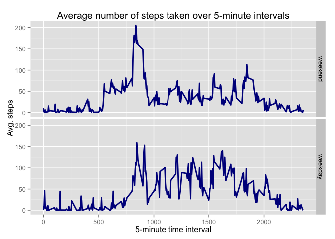

# Reproducible Research: Peer Assessment 1

### Prerequisites


#### Set system locale to (US) English

```r
Sys.setlocale("LC_TIME", "C")
```

### Loading and preprocessing the data

#### Load data file into data frame
- Source: https://d396qusza40orc.cloudfront.net/repdata%2Fdata%2Factivity.zip
- Date downloaded: Mar 4th 2015


```r
activity_data<-read.csv("activity.csv", header=TRUE)
```

#### Add row id to data frame

```r
activity_data$ID<-seq.int(nrow(activity_data))
```

Format date column as proper date and column steps as numeric

```r
activity_data$date<-ymd(activity_data$date)
activity_data$steps<-as.numeric(activity_data$steps)
```

#### Total number of steps taken per day

Group data frame by date and calculate frequency

```r
activity_data_freq<-aggregate(x = activity_data[c("steps")],
          FUN = sum, na.rm=TRUE,
          by = list(group.date = activity_data$date))
```

List of total number of steps taken per day:


#### Histogram of the total number of steps taken each day

```r
g<-ggplot(activity_data_freq, aes(x=steps)) + 
    geom_histogram(binwidth=2000, colour="black", fill="lightblue") +
    geom_vline(aes(xintercept=mean(steps, na.rm=T)), colour="red", linetype="dashed", size=1) + 
    geom_vline(aes(xintercept=median(steps, na.rm=T)), colour="purple", linetype="dashed", size=1) +
    ggtitle("Histogram of the total number of steps taken each day") +
    scale_colour_manual("", values = c("red"="Mean", "purple"="Mendia")) + 
    xlab("Steps") + 
    ylab("Frequency")

    plot(g)
```

 

```r
## Export plot to png file
#dev.copy(png,file="figures/Hist_1.png",width=480,height=480,res=72)
## Close file device
#dev.off()
```

### Mean and median of the total number of steps taken per day

Calculate mean

```r
steps_mean<-mean(activity_data_freq$steps, na.rm=T)
```
The mean is 9354.23 steps.

Calculate median

```r
steps_median<-median(activity_data_freq$steps, na.rm=T)
```
The median is 10395.00 steps.


### Time series plot of the 5-minute interval and the average number of steps taken, averaged across all days.

```r
activity_data_mean_date<-aggregate(x = activity_data[c("steps")],
                              FUN = mean, na.rm=TRUE,
                              by = activity_data[c("interval")])

timeseries<-filter(activity_data_mean_date,is.na(steps)==FALSE)

max_interval<-filter(timeseries,steps==max(steps))[[1]]
ggplot(timeseries, aes(interval, steps)) + 
    geom_line(lwd=1, colour="darkblue") +
    xlab("5-minute time interval") + 
    ylab("Avg. no. of steps per 5-minute time interval") +
    ggtitle("Average number of steps taken over 5-minute intervals") +
    geom_vline(aes(xintercept=max_interval), color="darkred", linetype="dashed", size=1) 
```

 

```r
## Export plot to png file
#dev.copy(png,file="figures/Timeseries.png",width=480,height=480,res=72)
## Close file device
#dev.off()
```

####5-minute interval containing maximum number of steps
The 5-minute interval, on average across all the days in the dataset, with maximum number of steps is 835.00.

#### Calculate the total number of missing values in the dataset (i.e. the total number of rows with NAs)

```r
activity_data_NA<-filter(activity_data,is.na(steps)==TRUE)
NoNAs<-nrow(activity_data_NA)
```

The total number of missing values in the data column "steps" id 2304.

### Imputing missing data
In the dataset column "steps" we have missing. Therefor, we execute two different methods of data imputation: mean imputation and random sample imputation.

#### Filling in all of the missing values in the dataset by the mean for matching 5-minute interval
Perhaps the easiest way to impute is to replace each missing value with the mean of the observed values for that variable. One has to be careful, because this strategy can severely distort the distribution for this variable.

Calculating the means of 5-minute intervals 

```r
activity_data_mean_date<-aggregate(x = activity_data[c("steps")],
                              FUN = mean, na.rm=TRUE,
                              by = activity_data[c("interval")])

activity_data_mean<-filter(activity_data_mean_date,is.na(steps)==FALSE)

activity_data_NA_2<-merge(activity_data,activity_data_mean,by="interval",all.x = TRUE)
activity_data_compl<-transform(activity_data_NA_2, steps.x = ifelse(is.na(steps.x), steps.y, steps.x))[(1:4)]
colnames(activity_data_compl)[2] <- "steps" 
```

Aggregate data

```r
activity_data_freq_compl<-aggregate(x = activity_data_compl[c("steps")],
                                    FUN = sum, na.rm=TRUE,
                                    by = list(group.date = activity_data_compl$date))
```

Plot result of imputation

```r
ggplot(activity_data_freq_compl, aes(x=steps)) + 
    geom_histogram(binwidth=2000, colour="black", fill="lightblue") +
    geom_vline(aes(xintercept=mean(steps, na.rm=T)), color="red", linetype="dashed", size=1) + 
    geom_vline(aes(xintercept=median(steps, na.rm=T)), color="purple", linetype="dotdash", size=1) +
    ggtitle("Histogram of the total number of steps taken each day") +
    xlab("Steps") + 
    ylab("Frequency")
```

 

```r
## Export plot to png file
#dev.copy(png,file="figures/Hist_2.png",width=480,height=480,res=72)
## Close file device
#dev.off()
```

Calculate mean

```r
steps_mean_compl<-mean(activity_data_freq_compl$steps, na.rm=T)
```
The mean is 10766.19 steps.

Calculate median

```r
steps_median_compl<-median(activity_data_freq_compl$steps, na.rm=T)
```
The median is 10766.19 steps.

The strategy of imputing mean values can distort the distribution for this variable, leading to complications with summary measures including, notably, underestimates of the standard.

### Filling in all of the missing values in the dataset by the random sample from column steps
The simplest approach is to impute missing values of earnings based on the observed
data for this variable. We use randomimp to create a completed data vector of the steps column by
imputing random draws into the missing values of the original steps column. 

Draw random samples from  5-minute interval data

```r
randomimp <- function (a){
    
    n<-length(a[is.na(a)])
    a[is.na(a)]<-sample(a[!is.na(a)],n,TRUE)
    return(a)
    
}

activity_data_sample<-randomimp(activity_data[,1])
activity_data[,1]<-activity_data_sample
```

Aggregate data

```r
activity_data_freq<-aggregate(x = activity_data[c("steps")],
                                     FUN = sum, na.rm=TRUE,
                                     by = list(group.date = activity_data$date))
```

Plot result of imputation

```r
ggplot(activity_data_freq, aes(x=steps)) + 
    geom_histogram(binwidth=2000, colour="black", fill="lightblue") +
    geom_vline(aes(xintercept=mean(steps, na.rm=T)), color="red", linetype="dashed", size=1) + 
    geom_vline(aes(xintercept=median(steps, na.rm=T)), color="darkred", linetype="dashed", size=1) +
    ggtitle("Histogram of the total number of steps taken each day") +
    xlab("Steps") + 
    ylab("Frequency")
```

 

```r
## Export plot to png file
#dev.copy(png,file="figures/Hist_3.png",width=480,height=480,res=72)
## Close file device
#dev.off()
```

Calculate mean

```r
steps_mean_compl<-mean(activity_data_freq$steps, na.rm=T)
```
The mean is 10708.18 steps.

Calculate median

```r
steps_median_compl<-median(activity_data_freq$steps, na.rm=T)
```
The median is 10765.00 steps.

#### Summary data imputation
Generally the data imputation tends to bring mean and median closer together. In the case of the mean value imputation, both are identical. In the case of random sample imputation both mean and median are very close together. In both cases, however, the mean and median shift to higher values.

### Are there differences in activity patterns between weekdays and weekends?

To anwer this quation we create a new factor variable in the dataset with two levels – “weekday” and “weekend” indicating whether a given date is a weekday or weekend day.


```r
activity_data$dayofweek<-factor(weekdays(activity_data$date) %in% c('Saturday','Sunday'))
levels(activity_data$dayofweek)[levels(activity_data$dayofweek)=="TRUE"] <- "weekday"
levels(activity_data$dayofweek)[levels(activity_data$dayofweek)=="FALSE"] <- "weekend"
```

Aggregate data

```r
activity_data_mean_date<-aggregate(x = activity_data[c("steps")],
                                   FUN = mean, na.rm=TRUE,
                                   by = activity_data[c("interval","dayofweek")])
```

Plot result

```r
ggplot(activity_data_mean_date, aes(interval, steps)) + 
      geom_line(lwd=1, colour="darkblue") +
      xlab("5-minute time interval") + 
      ylab("Avg. steps") +
      ggtitle("Average number of steps taken over 5-minute intervals") +
      facet_grid(dayofweek ~ .)
```

 

```r
## Export plot to png file
#dev.copy(png,file="figures/Patterns.png",width=480,height=480,res=72)
## Close file device
#dev.off()
```

The pattern during the weekend is more concentrated around interval 800. The pattern during the week is more spread out and shows several maxima.

### References
1. http://www.stat.columbia.edu/~gelman/arm/missing.pdf
2. http://www.rd.dnc.ac.jp/~tunenori/doc/elml_2013_3_20_50062.pdf
3. https://class.coursera.org/repdata-012/human_grading/view/courses/973513/assessments/3/submissions
